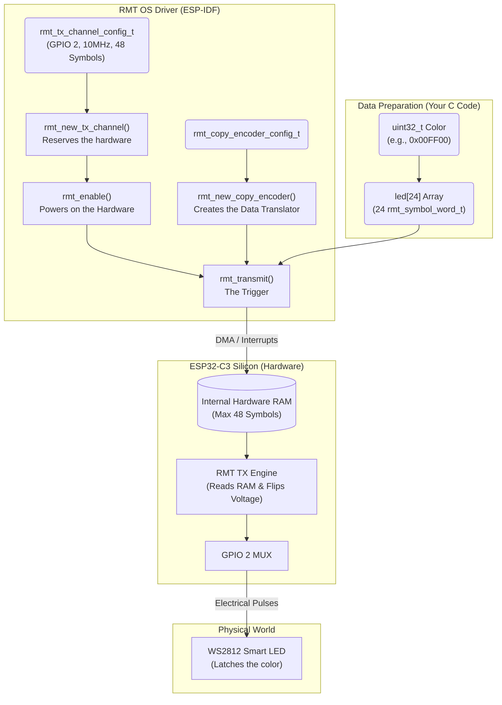

# WS2812 & RMT Protocol Architecture

## 1. The WS2812 Protocol (Smart LEDs)
Standard LEDs turn on/off instantly based on voltage. The WS2812 contains an embedded microchip (a latch).
*   **Packet Structure:** It requires 24 bits of color data per LED.
*   **Byte Order:** It demands **GRB** order (Green first, then Red, then Blue).
*   **Bit Order (The MSB Challenge):** It demands **MSB-First** (Most Significant Bit first). 
    *   **The Problem:** Little-endian processors (like the ESP32-C3) naturally store and process the LSB (Least Significant Bit) first. 
    *   **Our Solution in C:** Instead of trying to flip the memory physically, we used iterative bit-shifting during the payload generation: `(color >> (23 - i)) & 1`. By subtracting `i` from `23`, the `for` loop dynamically reads bit 23 (MSB) on the 0th iteration, bit 22 on the 1st, and so on. This safely extracts the MSB first and maps it into the RMT array in the exact hardware order the WS2812 requires, perfectly bridging the Little-Endian to MSB gap.
*   **The Latch:** Once it receives a 24-bit packet, it keeps the LED glowing permanently. You do not need to refresh the signal unless you want to change the color or turn it off (`0x000000`).

## 2. The RMT Hardware Architecture
The Remote Control (RMT) peripheral is a hardware engine designed to transmit and receive infrared and specific timing signals. We hijack it to generate the microsecond WS2812 pulses.
*   **Hardware RAM:** The ESP32-C3 RMT engine only has **48 symbols** of hardware RAM per channel. 
*   **Channel Merging (The 64 Symbol Trap):** If you request 64 symbols of RAM, the ESP-IDF driver silently claims **two** hardware channels and electrically stitches their RAM together. Because the ESP32-C3 only has 2 TX channels total, requesting 64 symbols consumes the entire chip's transmission capability.
*   **Looping (`loop_count`):** Setting `.loop_count = 3` tells the RMT hardware to blast the payload 4 times consecutively. Because the WS2812 consumes the first 24 bits and blindly passes the rest to the next LED, looping on a single LED has no visual effect. But on a strip of 4 LEDs, they would all light up simultaneously!

## 3. RMT to WS2812 Architecture Flowchart

### The Sequence Explained
1. **The Blueprint:** You define `rmt_tx_channel_config_t` and give it to `rmt_new_tx_channel`. ESP-IDF finds an unused hardware engine inside the C3 and configures it to output on GPIO 2.
2. **Power On:** `rmt_enable` flips the power switch on that specific hardware engine.
3. **The Data:** You build a 24-element array in standard C memory. (This is where the MSB bit-shifting happens).
4. **The Translator:** The RMT hardware requires data in a very specific memory block format. The `copy_encoder`'s only job is to translate/move your C array into the hardware.
5. **The Trigger:** `rmt_transmit` takes your `channel`, your `encoder`, and your `array`. It tells the encoder to dump the array into the hardware RAM, and immediately tells the hardware engine to start reading that RAM and blasting the pulses out of GPIO 2.
