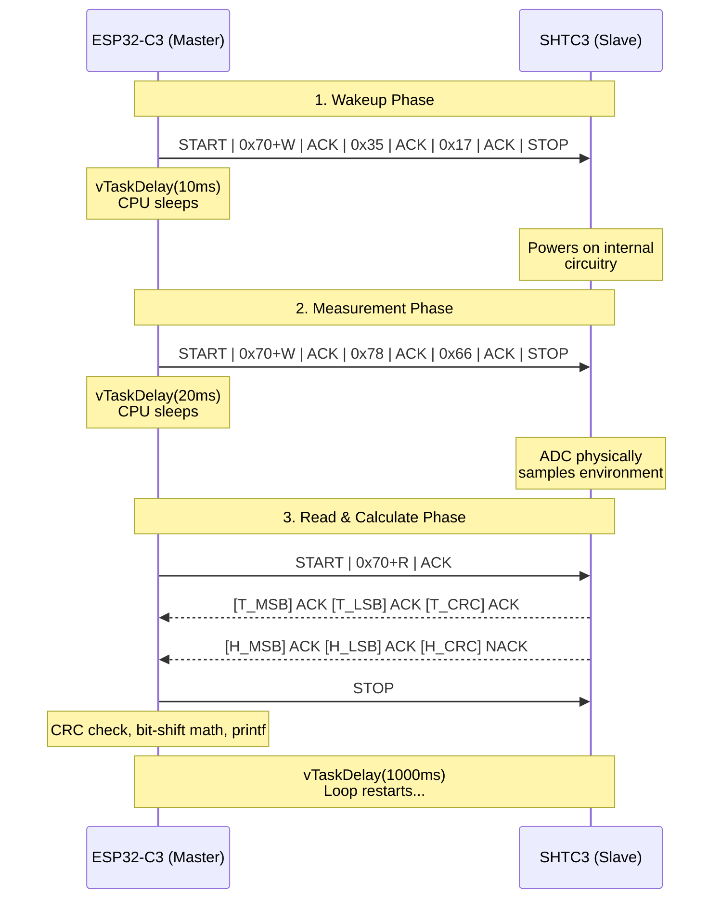

# Method 1: I2C with the ESP-IDF C Prebuilt Library — Complete Deep Dive

> **Project:** `i2c_shtc3_lib`
> **Sensor:** Sensirion SHTC3 (Temperature + Humidity)
> **Board:** ESP32-C3-DevKit-RUST-1
> **ESP-IDF Version:** v6.0.2
> **Datasheet:** [Sensirion SHTC3 Datasheet](https://sensirion.com/media/documents/643F9C8E/63A5A436/Datasheet_SHTC3.pdf)
> **Board Schematic:** [esp-rs/esp-rust-board on GitHub](https://github.com/esp-rs/esp-rust-board)

---

## Part 1: The I2C Protocol — From Electrical Level to Application Level

### 1.1 Why I2C Exists — The Problem It Solves

Before I2C, if you wanted to connect 10 sensors to a microcontroller, you needed 10 or more separate wires, one for each sensor's data pin. As the number of peripherals grew, the number of wires became unmanageable.

**I2C (Inter-Integrated Circuit)**, invented by Philips in 1982, solved this by creating a shared bus. Every single device on the bus shares the **same two wires**. The trick to avoiding chaos is an addressing system — every device has a unique hardware address baked into its silicon, and the controller announces which device it's talking to at the start of every transaction.

### 1.2 The Physical Layer — Electricity on the Wire

This is the foundation. If you forget everything else, remember these two physical facts.

**Fact 1: There are exactly two signal wires.**
| Wire | Full Name | Purpose |
|------|-----------|---------|
| `SDA` | Serial Data Line | Carries the actual data (addresses + bytes) |
| `SCL` | Serial Clock Line | A shared heartbeat so all devices agree on timing |

Both wires also need a connection to the supply voltage (3.3V on our board) through **pull-up resistors**. Your ESP32-C3-DevKit-RUST-1 board has these resistors already soldered onto the PCB, which is why you don't need to add external ones.

**Fact 2: The bus is "Open-Drain" (Wired-AND logic).**

This is the clever trick that allows multiple devices to share the same wire without burning each other out.

- No device is *ever* allowed to actively drive the wire HIGH (push current into it).
- Any device CAN pull the wire LOW (drain current to ground) by turning on a transistor.
- When **no device** is pulling low, the pull-up resistor holds the line HIGH by default.
- If **any** device pulls low, the entire wire goes LOW, regardless of what others are doing.

**Why this matters:** If two devices tried to fight over the bus at the same time (one pushing HIGH, one pulling LOW), they would form a short circuit and potentially damage the hardware. The open-drain design eliminates this risk entirely.

### 1.3 The Clock — Who Controls Timing?

The `SCL` (clock) line is controlled exclusively by the **Master** (your ESP32-C3). The master toggles this line at a specific frequency to create a shared heartbeat. Every participant on the bus reads or writes one bit per clock pulse. This is why it is called a **synchronous** protocol.

**I2C Speed Modes:**
| Mode | Speed |
|------|-------|
| Standard Mode | 100 kHz (our choice) |
| Fast Mode | 400 kHz |
| Fast Mode Plus | 1 MHz |
| High Speed | 3.4 MHz |

### 1.4 The Transaction Structure — How a Conversation Works

Every I2C transaction follows a rigid protocol:

```
START | ADDRESS (7 bits) | R/W (1 bit) | ACK | DATA BYTE 1 | ACK | ... | STOP
```

**Step-by-step walkthrough:**

1. **START Condition:** The master pulls SDA LOW while SCL remains HIGH. This specific pattern is the agreed-upon "I'm about to start talking" signal.

2. **Address Phase (7 bits):** The master clocks out the 7-bit address of the device it wants to speak to (e.g., `0x70` for SHTC3). ALL devices on the bus receive this and check "is that my address?"

3. **Read/Write Bit (1 bit):** The 8th bit tells the device the direction:
   - `0` = Write (Master will send data *to* the device)
   - `1` = Read (Master wants to *receive* data from the device)

4. **ACK/NACK:** After the 8 bits, the master releases SDA. If the addressed device recognizes its address, it pulls SDA LOW for one clock pulse — this is the **ACK**. If no device responds, SDA stays HIGH — this is the **NACK** and the driver returns `ESP_ERR_INVALID_RESPONSE`.

5. **Data Phase:** One byte at a time, 8 bits per byte, MSB first. After each byte, the receiver sends an ACK pulse back.

6. **STOP Condition:** The master pulls SDA HIGH while SCL remains HIGH. This signals the end of the transaction.

### 1.5 Master vs. Slave

| Term (Old) | Term (New IEEE) | Role |
|------------|-----------------|------|
| Master | Controller | Initiates all transactions, generates the clock |
| Slave | Target/Peripheral | Responds only when addressed, never initiates |

In our project: **ESP32-C3 = Master/Controller** and **SHTC3 = Slave/Target**.

### 1.6 Clock Stretching — The Slave's Emergency Brake

The Slave device cannot negotiate the bus speed; it is entirely at the mercy of the Master's clock. If the Master clocks at 100 kHz, the Slave must keep up. It only has a maximum physical speed limit (1 MHz for the SHTC3). 

However, there is **one** exception: **Clock Stretching**.
If the Master is clocking data too fast, or if the Slave needs a few milliseconds to process a command (like taking a temperature reading), the Slave can physically pull the `SCL` (clock) line LOW and hold it there. 

When the Master tries to release the SCL line to go HIGH for the next pulse, it will see that the line is still LOW. The Master is forced to pause and wait until the Slave finally releases the SCL line back to HIGH. 
*(Note: We specifically used the SHTC3 command `0x7866` which means "Normal Mode, **Clock Stretching Disabled**", so our sensor doesn't use this brake. We handle the waiting ourselves using `vTaskDelay()` instead).*

---

## Part 2: The Sensor — Sensirion SHTC3 Internals

### 2.1 What Is It?

The SHTC3 is a **digital temperature and humidity sensor** by Sensirion. "Digital" means it internally converts the physical measurement into a binary number and sends it over I2C — far more noise-immune than analog sensors.

**Key Specifications (from the datasheet):**
| Specification | Value |
|---------------|-------|
| I2C Address | `0x70` (hardwired, cannot change) |
| Address Length | 7-bit |
| Supply Voltage | 1.62V to 3.6V |
| I2C Speed | Up to 1 MHz |
| Temperature Range | -40°C to +125°C |
| Temperature Accuracy | ±0.2°C (typical) |
| Humidity Range | 0% to 100% RH |
| Humidity Accuracy | ±2% RH (typical) |
| Package | DFN, 2mm x 2mm |
| CRC Polynomial | 0x31 (CRC-8) |

### 2.2 Board-Specific Pin Assignment

The ESP32-C3's **GPIO Matrix** is an internal hardware switchboard that lets you route the I2C controller's SDA and SCL signals to almost any GPIO pin. **The TRM does not tell you which pins to use — the board schematic does.**

```
SHTC3 Physical Pin (SDA) ----[copper trace on PCB]----> ESP32-C3 GPIO 10
SHTC3 Physical Pin (SCL) ----[copper trace on PCB]----> ESP32-C3 GPIO 8
```
Confirmed via the open-source hardware files at the [esp-rs/esp-rust-board GitHub repository](https://github.com/esp-rs/esp-rust-board).

### 2.3 Power Management — Why the Wakeup Command?

The SHTC3 enters **Sleep Mode** by default to conserve power (~0.3 µA). Before any measurement, you **must** send it the Wake-Up command. After reading, you should send the Sleep command in a real battery-powered product.

### 2.4 The Command Table (Datasheet Section 5, Tables 8 & 9)

| Command | Byte 1 | Byte 2 | Purpose |
|---------|--------|--------|---------|
| Wakeup | `0x35` | `0x17` | Wake the sensor from sleep |
| Sleep | `0xB0` | `0x98` | Put the sensor back to sleep |
| Measure (Normal, No CS, T first) | `0x78` | `0x66` | Trigger a full measurement |
| Measure (Low Power, No CS, T first) | `0x60` | `0x9C` | Faster, less accurate |
| Soft Reset | `0x80` | `0x5D` | Reset the sensor |

**Why `0x7866` (Normal Mode, No Clock Stretching)?**
- **Normal Mode** uses full resolution for maximum accuracy (±0.2°C).
- **No Clock Stretching** means the sensor does NOT hold SCL low. We handle the wait explicitly with `vTaskDelay()`, which is simpler and more compatible.
- **Temperature First** determines the byte order in the 6-byte response.

### 2.5 The Response Packet — 6 Bytes Explained

```
Byte Index:   [ 0 ]       [ 1 ]       [ 2 ]       [ 3 ]       [ 4 ]       [ 5 ]
Content:   [Temp MSB]  [Temp LSB]  [Temp CRC]  [Hum MSB]   [Hum LSB]   [Hum CRC]
```

| Byte | Description |
|------|-------------|
| `data[0]` | Temperature — Most Significant Byte (upper 8 bits of the 16-bit reading) |
| `data[1]` | Temperature — Least Significant Byte (lower 8 bits of the 16-bit reading) |
| `data[2]` | Temperature CRC-8 checksum (verifies `data[0]` and `data[1]`) |
| `data[3]` | Humidity — Most Significant Byte |
| `data[4]` | Humidity — Least Significant Byte |
| `data[5]` | Humidity CRC-8 checksum (verifies `data[3]` and `data[4]`) |

### 2.6 MSB and LSB — Why Two Bytes for One Number?

The SHTC3 measures with 16-bit precision (values from 0 to 65535). But I2C transmits one byte (8 bits) at a time. The SHTC3 uses **Big-Endian / MSB-First** ordering.

**Reassembling two bytes into one 16-bit number in C:**
```c
uint16_t raw_temp = (data[0] << 8) | data[1];
```

- `data[0] << 8` is the **left bit-shift operator**. It moves all bits 8 positions left (multiplies by 256), placing `data[0]` in the upper byte of the 16-bit integer.
- `| data[1]` is the **bitwise OR**, placing `data[1]` in the lower byte.
- The result is the full 16-bit measurement.

**Example:**
```
data[0] = 0x76 = 0111 0110
data[1] = 0xE2 = 1110 0010

data[0] << 8  = 0111 0110 0000 0000  (upper 8 bits)
data[1]       = 0000 0000 1110 0010  (lower 8 bits)
OR result     = 0111 0110 1110 0010  = 0x76E2 = 30434 raw
```

### 2.7 The Conversion Formulas (Datasheet Section 5.4)

**Temperature:**
```
temp_c = -45 + 175 × (raw_temp / 65535)
```
- `raw_temp = 0` → `-45°C`
- `raw_temp = 65535` → `+130°C`

**Humidity:**
```
humid_rh = 100 × (raw_humid / 65535)
```
- `raw_humid = 0` → `0% RH`
- `raw_humid = 65535` → `100% RH`

**Critical C Note — Float Casting:**
```c
// WRONG — Integer division, result is always 0!
float temp_c = -45.0 + (175.0 * (raw_temp / 65535));

// CORRECT — Cast to float first to preserve decimal precision
float temp_c = -45.0 + (175.0 * ((float)raw_temp / 65535.0));
```

---

## Part 3: The CRC-8 Checksum — Verifying Data Integrity

### 3.1 Why CRC Exists

A stray electromagnetic pulse in a noisy environment can flip a single bit in transit. Without a check, your code silently computes a wrong temperature. A **CRC (Cyclic Redundancy Check)** is a mathematical fingerprint appended to the data. You recalculate it and compare.

### 3.2 SHTC3's CRC-8 Specification (Datasheet Section 4.3)

| Parameter | Value |
|-----------|-------|
| Width | 8 bits |
| Polynomial | `0x31` (x^8 + x^5 + x^4 + 1) |
| Initialization | `0xFF` |
| Final XOR | None |

### 3.3 How the Algorithm Works

1. Start with `crc = 0xFF`.
2. For each data byte:
   - XOR the byte into `crc`.
   - For each of 8 bits: if the highest bit of `crc` is `1`, shift left and XOR with polynomial `0x31`. Otherwise, just shift left.
3. Compare the final `crc` value with the sensor's checksum byte.

### 3.4 The CRC Function

```c
uint8_t verify_crc(uint8_t data[2], uint8_t expected_checksum) {
    uint8_t crc = 0xFF;                    // Initialize per spec
    for (int i = 0; i < 2; i++) {
        crc ^= data[i];                    // Mix data byte into crc
        for (int bit = 8; bit > 0; --bit) {
            if (crc & 0x80) {              // If MSB is set...
                crc = (crc << 1) ^ 0x31;  // ...shift and XOR with polynomial
            } else {
                crc = (crc << 1);          // Otherwise just shift
            }
        }
    }
    return (crc == expected_checksum) ? 1 : 0;
}
```

---

## Part 4: The ESP-IDF `i2c_master` API Reference

**Include:** `#include "driver/i2c_master.h"`
**CMakeLists.txt REQUIRES:** `esp_driver_i2c`

### 4.1 Data Structures

#### `i2c_master_bus_config_t` — Physical Bus Configuration

| Member | Type | Our Value | Explanation |
|--------|------|-----------|-------------|
| `i2c_port` | `i2c_port_num_t` | `-1` | Auto-select the hardware I2C peripheral. ESP32-C3 has only one. |
| `sda_io_num` | `gpio_num_t` | `GPIO_NUM_10` | SDA pin — from the board schematic |
| `scl_io_num` | `gpio_num_t` | `GPIO_NUM_8` | SCL pin — from the board schematic |
| `clk_source` | `i2c_clock_source_t` | `I2C_CLK_SRC_DEFAULT` | Use the default APB clock |
| `glitch_ignore_cnt` | `uint8_t` | `7` | Espressif's recommended glitch filter. Ignores electrical spikes < 7 clock cycles. |

#### `i2c_device_config_t` — Specific Device Configuration

| Member | Type | Our Value | Explanation |
|--------|------|-----------|-------------|
| `dev_addr_length` | `i2c_addr_bit_len_t` | `I2C_ADDR_BIT_LEN_7` | SHTC3 uses a 7-bit address |
| `device_address` | `uint16_t` | `0x70` | The SHTC3's hardwired I2C address |
| `scl_speed_hz` | `uint32_t` | `100000` | 100 kHz Standard Mode |

### 4.2 Handle Types

| Type | Description |
|------|-------------|
| `i2c_master_bus_handle_t` | Opaque handle to the configured I2C bus. Obtained from `i2c_new_master_bus()`. |
| `i2c_master_dev_handle_t` | Opaque handle to a specific device on the bus. Obtained from `i2c_master_bus_add_device()`. |

### 4.3 Functions

#### `i2c_new_master_bus()`
```c
esp_err_t i2c_new_master_bus(
    const i2c_master_bus_config_t *bus_config,
    i2c_master_bus_handle_t       *ret_bus_handle
);
```
Initializes the I2C hardware peripheral. Configures the GPIO Matrix to route the I2C controller to your specified GPIO pins.

#### `i2c_master_bus_add_device()`
```c
esp_err_t i2c_master_bus_add_device(
    i2c_master_bus_handle_t   bus_handle,
    const i2c_device_config_t *dev_config,
    i2c_master_dev_handle_t   *ret_handle
);
```
Registers a device on the bus. No I2C transaction happens here — the driver just stores the address and speed for future calls.

#### `i2c_master_transmit()`
```c
esp_err_t i2c_master_transmit(
    i2c_master_dev_handle_t i2c_dev,
    const uint8_t          *write_buffer,
    size_t                  write_size,
    int                     xfer_timeout_ms
);
```
Sends bytes to the target device. On the wire: `START → ADDRESS+W → ACK → BYTES → STOP`.

> [!IMPORTANT]
> `xfer_timeout_ms` is a **bus error timeout**, NOT a delay! The function completes in microseconds. Use `vTaskDelay()` separately to wait for sensor operations.

#### `i2c_master_receive()`
```c
esp_err_t i2c_master_receive(
    i2c_master_dev_handle_t i2c_dev,
    uint8_t                *read_buffer,
    size_t                  read_size,
    int                     xfer_timeout_ms
);
```
Reads bytes from the target device. On the wire: `START → ADDRESS+R → ACK → BYTES (ACK after each) → NACK → STOP`.

---

## Part 5: Complete Timing Diagram

This is the full sequence every iteration of our `while(1)` loop:



---

## Part 6: Key Learnings, Intuitions, and Gotchas

### 6.1 `timeout` ≠ `delay` — The Most Important Lesson
`pdMS_TO_TICKS(100)` inside `i2c_master_transmit()` is a **bus stuck timeout**. The function completes in ~2µs for a 2-byte transfer at 100kHz. The wakeup delay must be a separate explicit `vTaskDelay()`.

### 6.2 Old `i2c.h` vs New `driver/i2c_master.h`
ESP-IDF has two I2C APIs. The old `i2c.h` is legacy/deprecated. The new `driver/i2c_master.h` is the officially recommended API for all new projects. The old API required manually building I2C command buffers; the new API provides simple function calls.

### 6.3 GPIO Matrix — Software-Defined Pins
Unlike AVR Arduinos with fixed SDA/SCL pins, the ESP32-C3's GPIO Matrix allows routing to almost any pin in software. **Always check the board schematic, not the TRM, for pin assignments.**

### 6.4 `i2c_port = -1` Auto-Select
Setting `-1` tells the driver to auto-assign the hardware I2C peripheral. Only matters on chips with multiple peripherals (ESP32 has 2). ESP32-C3 has only one.

### 6.5 Why `ESP_ERROR_CHECK()` is Critical
Without it, a failed `i2c_master_transmit()` returns an error code silently. Your code continues with `data[6]` full of zeros, printing `Temperature: -45.00°C` forever with no clue what's wrong. `ESP_ERROR_CHECK()` turns silent failure into a descriptive abort with file name and line number.

### 6.6 `glitch_ignore_cnt = 7`
The I2C spec requires a spike filter to ignore pulses shorter than ~50ns. The value `7` is Espressif's own recommended default. Rarely needs changing unless debugging specific EMI issues.

### 6.7 `%f` not `%d` for floats in printf
`%d` tells the CPU to interpret the next argument as an integer. Passing a `float` with `%d` causes the CPU to misread the IEEE-754 float's binary representation as an integer and print garbage. Always use `%f` (or `%.2f` for 2 decimal places) for floating-point values.

### 6.8 Sensor Validation — The "Breath Test"
If your sensor is reading values but you aren't sure it's real: exhale slowly onto it. A real sensor's humidity spikes above 80% and temperature increases within 2-3 seconds. A stuck/simulated reading will not react. The SHTC3 reacted perfectly in our testing.

### 6.9 The Glitch Filter Explained (`glitch_ignore_cnt`)
In the real physical world, electromagnetic interference (EMI) from motors, microwaves, or nearby power supplies can induce tiny, microsecond-long voltage spikes on your I2C wires. Without a filter, the ESP32-C3 might read a random spike and think, *"The SCL clock line just pulsed!"*, corrupting the data.
The ESP32-C3's internal I2C hardware has a digital filter. Setting `glitch_ignore_cnt = 7` tells the hardware: *"If you see the SDA or SCL line change state, wait for 7 internal APB clock cycles (about 87 nanoseconds). If the signal goes back to normal before 7 cycles, it was a fake electrical glitch—ignore it!"* Real 100kHz I2C pulses last thousands of nanoseconds, easily passing the filter.

---

## Part 7: Verified Real-World Output

Captured from the serial monitor while breathing on the sensor:

```
Temperature: 29.58 °C    Humidity: 74.44 %
Temperature: 29.57 °C    Humidity: 74.36 %

--- (Breath test) ---

Temperature: 31.62 °C    Humidity: 77.44 %
Temperature: 32.23 °C    Humidity: 90.88 %
Temperature: 33.47 °C    Humidity: 94.32 %    ← Peak from breath

--- (Recovery) ---

Temperature: 31.47 °C    Humidity: 93.21 %
Temperature: 31.32 °C    Humidity: 92.85 %
```

---

## Part 8: API I2C References

- [ESP-IDF I2C Master Driver Guide](https://docs.espressif.com/projects/esp-idf/en/stable/esp32c3/api-reference/peripherals/i2c.html)
- [Sensirion SHTC3 Datasheet PDF](https://sensirion.com/media/documents/643F9C8E/63A5A436/Datasheet_SHTC3.pdf)
- [esp-rs/esp-rust-board Schematic (GitHub)](https://github.com/esp-rs/esp-rust-board)
